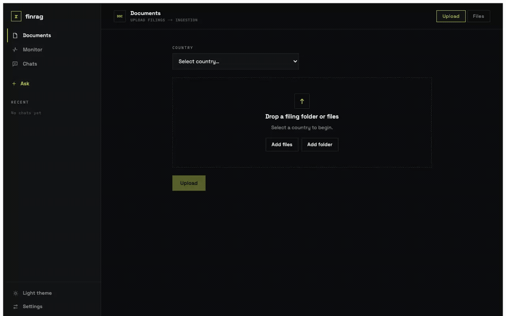

<div align="center">

# finrag

**Agentic RAG over financial filings — exact figures from a structured store, narrative from hybrid vector retrieval, behind one agentic router and a grounding harness.**

[](https://www.python.org/)
[](https://fastapi.tiangolo.com/)
[](https://nextjs.org/)
[](https://www.docker.com/)
[](https://docs.astral.sh/ruff/)


</div>

---

## Demo

<div align="center">



*Upload a filing → watch it ingest stage-by-stage in the monitor → ask, and get a streamed, cited answer.*

</div>

> The GIF is recorded against **mock data**, not real filings. To re-record it, see
> [`assets/README.md`](assets/README.md).

---

## Why finrag

Financial Q&A breaks generic RAG: the hard part is that **a number must be exactly right**
(a figure off by a digit is worse than no answer), while the surrounding **narrative** wants
fuzzy semantic recall. finrag splits the two:

- **Exact figures** come from a **structured store** — XBRL facts (the filer's as-filed values)
  and extracted tables — answered by a **metric registry → text-to-SQL**, never paraphrased by an LLM.
- **Narrative** comes from **hybrid retrieval** — dense (Qdrant) + lexical, **RRF-fused**, reconciled to
  the latest filing version, then cross-encoder **reranked**.
- An **agentic router** picks **exact vs narrative** per question; an exact lookup that finds nothing
  **falls back** to narrative.
- A **self-correcting harness** verifies groundedness and **re-generates until every claim is cited and
  supported** (budget-capped) — so a *local* LLM stays trustworthy.

### A configurable RAG lab

Most stages are **pluggable adapters selected by config** — embedder, vector/structured store, retriever,
reranker, router, harness, LLM backend, guards. Swap one and **compare techniques with real evaluation
numbers** (`python -m finrag.eval`); the capability matrix — what's *active* vs merely declared — is served
live at `/config`. Parsing and chunking are **adaptive internal pipelines**, not single-pick slots: the
**chunk router** runs structure-aware, semantic, and fixed strategies and keeps the best by a quality gate.

---

## Features

- **Exact figures, not guesses** — XBRL facts (Arelle) answered by a **metric registry → guarded text-to-SQL** (AST-checked, single-SELECT, projection-locked), never paraphrased by an LLM
- **Agentic routing + self-correction** — per-question exact-vs-narrative routing; a generate→verify→regenerate loop that won't answer until it clears a groundedness bar
- **Adaptive chunking** — a chunk router runs structure-aware / semantic / fixed and keeps the best by a 4-metric quality gate; format-aware parsing (SEC-HTML, Docling vision, pdfium rescue)
- **US + India** — country-routed identity (XBRL DEI for US; cover-title rules + LLM fallback for India) and India-aware PII
- **Hybrid retrieval** — bge-m3 (dense + sparse, in-process) and BM25 lexical, RRF-fused, version-reconciled, then bge cross-encoder reranked
- **Safety + privacy** — heuristic input/output guards and regex+checksum PII (12 types, US + India), screened even mid-stream on the SSE
- **Conversational** — persistent chat sessions with short-term memory (recent turns feed a history-aware rewrite)
- **Comparison-driven eval** — a runnable harness (`python -m finrag.eval`): synthetic golden set → metrics → leaderboard
- **Observability built in** — in-process tracer → Langfuse (OTLP) / Redis; live ingest + query DAGs in the UI; per-call tokens and cost
- **Runs fully local** — Ollama + Qdrant + Postgres, `$0` cost model in dev

---

## Architecture

One flow, end to end. Event-driven ingestion writes the stores; the **agentic query
path** reads them — routing each question to an *exact* or *narrative* answer, fusing
and reconciling retrieved evidence, and **self-correcting until the answer is grounded
and cited**.

```
        ┌──────────────────────────────────────────────────────────────────┐
        │                          Next.js frontend                         │
        │              chat  ·  sources  ·  live ingest monitor             │
        └───────────────┬─────────────────────────────────▲────────────────┘
           upload /      │                                 │  SSE stream:
           question      ▼                                 │  tokens · agent-trace · cost
        ┌──────────────────────────────────────────────────────────────────┐
        │      FastAPI   ·   /ingest    /query · /chat    /config /monitor   │
        └───────┬──────────────────────────────────────────────────────────┘
                │
  ══════════════╧═══════════════  INGESTION (event-driven)  ═══════════════════
                ▼
   upload ─► MinIO ─►(bucket notify)─► Redpanda ─► consumer ─► detect (Tika)
                                                                  │
                                       ┌──────────────────────────┴───────────┐
                                       ▼ XBRL                                  ▼ PDF / IMAGE
                              Arelle — exact facts            Docling — layout · tables · OCR
                                       │                                       │
                                       │                            chunk (router: structure/semantic/fixed)
                                       │                                       │
                                       │                            embed (bge-m3)
                                       ▼                                       ▼
                              structured store                       vector store (Qdrant)
                              (Postgres / DuckDB)
                                       └── per-stage progress ─► Redis ─► SSE ─► UI monitor

  ════════════════════════════════  AGENTIC QUERY  ════════════════════════════
                ▼
   input guard ──── injection / jailbreak screen                  (blocked → refuse)
                ▼
   understand ───── history-aware rewrite  +  entity resolution (scope to the company)
                ▼
   ROUTER (agent) ── exact figure, or narrative?
        │
        ├─ exact ─► EXACT PATH  (deterministic · no LLM)
        │             metric-registry ─► text-to-SQL fallback ─► read as-filed fact
        │                  ├─ found ──────────────────────────────► (output guard ▼)
        │                  └─ not found ─► fall back to narrative ▼
        └─ narrative ───────────────────────────────────────────► NARRATIVE PATH ▼

   NARRATIVE PATH
        retrieve ─ hybrid: dense (Qdrant) + lexical ─► RRF fuse ─► reconcile (latest) ─► rerank
                ▼
        generate (Ollama) ─ evidence-only prompt, cites [n]
            ▲                        │
            │ regenerate (≤ 2)       ▼
            └──── grounded? ◄── verify (harness): numeric match + LLM judge
                                     │ yes
                ▼◄───────────────────┘
   output guard ─► PII redaction ─► grounded, cited answer ─► SSE stream ─► UI chat

  ─────────────────────────────────────────────────────────────────────────────
  Infra:  Postgres · DuckDB · Qdrant · MinIO · Redpanda · Redis · Ollama · Tika
```

What makes it **agentic**: the router chooses the path per question, the exact path
**falls back** to narrative when a figure isn't found, and the narrative path runs a
**generate → verify → regenerate** loop (budget-capped) that won't return an answer
until it clears a groundedness bar.

---

## Quick start

```bash
cp .env.example .env
make dev       # build + start everything: api, ollama, qdrant, postgres, redis, minio + frontend
curl localhost:8000/health
curl localhost:8000/config   # capability matrix: which adapter is active per stage
```

Backend development:

```bash
make install   # uv sync
make check     # lint + type-check + test
make test      # pytest
```

Requires [uv](https://docs.astral.sh/uv/) and Docker.

---

## Configuration

Configuration is layered: `config/config.yaml` → `config/config.<env>.yaml` → `FINRAG_*` env vars.
The `adapters` block is the **capability matrix** — `active` is the selected implementation; `available`
lists declared alternatives. A stage counts as implemented only when a class is registered for it; below,
`*` marks a **declared slot with no implementation yet**. `/config` serves the live matrix.

| Stage                | Active                          | Alternatives                                       |
| -------------------- | ------------------------------- | -------------------------------------------------- |
| `identity_extractor` | `us` · `india` (per country)    | —                                                  |
| `structured_qa`      | `text_to_sql` (after registry)  | `table_qa*`                                        |
| `embedder`           | `bge_m3`                        | `e5*`, `nomic*`, `fin_e5*`                          |
| `vector_store`       | `qdrant`                        | `weaviate*`, `pgvector*`                            |
| `structured_store`   | `postgres`                      | `duckdb`                                            |
| `retriever`          | `hybrid`                        | `dense*`, `sparse*`                                |
| `reranker`           | `bge_reranker`                  | `jina*`, `none*`                                   |
| `router`             | `rules`                         | `llm_classify*`, `embedding_classifier*`           |
| `harness`            | `citation_verify`               | `self_consistency*`, `reflection*`, `judge_gate*`  |
| `llm_backend`        | `ollama`                        | `vllm*`, `tgi*`                                    |
| `pii`                | `regex` (US + India)            | `presidio*`                                        |

Parsing and chunking aren't single-pick slots — parsing is **format-dispatched** (SEC-HTML / Docling /
pdfium) and the **chunk router** scores three strategies and keeps the best. See `config/config.yaml` for
the full matrix.

---

## Repository

```
backend/   FastAPI service and the RAG pipeline (see backend/README.md)
frontend/  Next.js UI — chat, sources, live ingest monitor
config/    layered configuration (config.yaml + config.<env>.yaml)
infra/     Dockerfile + compose
assets/    demo media
```

Adapters register against a process registry with a decorator next to the class; each stage
subpackage imports its adapter modules so registration runs, and `core/bootstrap.py` imports every
subpackage at startup. Config then selects the active adapter for each config-driven stage. See
[`backend/README.md`](backend/README.md) for the adapter mechanics.

---

## Roadmap

**Done**

- [x] Event-driven ingestion (upload → MinIO → Redpanda → consumer) — **US and India**
- [x] XBRL facts via Arelle; metric-registry → guarded text-to-SQL exact path
- [x] Adaptive chunk router (structure-aware / semantic / fixed + quality gate)
- [x] Hybrid retrieval (bge-m3 dense+sparse + BM25), RRF fusion, version reconcile, bge reranker
- [x] Agentic router + self-correcting (generate→verify→regenerate) harness
- [x] Guards (input/output) + regex/checksum PII (US + India), SSE segment screening
- [x] Persistent chat with short-term memory; live ingest + query DAGs in the UI
- [x] Comparison eval harness (synthetic golden set → metrics → leaderboard)
- [x] Observability: tracer → Langfuse (OTLP) + Redis; local `$0` cost model

**Next — declared adapter slots / future verticals**

- [ ] EDGAR auto-fetch connector (upload is the entry today)
- [ ] Alternative adapters: vLLM/TGI, weaviate/pgvector, Llama-Guard/NeMo/Presidio, decompose/HyDE, LLM router
- [ ] Multimodal (chart/figure) retrieval vertical (colpali slot)
- [ ] Graph RAG vertical (neo4j slot)

---

## Contributing

Issues and PRs welcome. Before opening a PR:

```bash
make check   # lint (Ruff) + type-check (mypy) + tests must be green
```

Frontend uses Biome (`pnpm lint`, `pnpm format`). Keep changes scoped and adapters pluggable.

---

## License

License: **TBD**.
